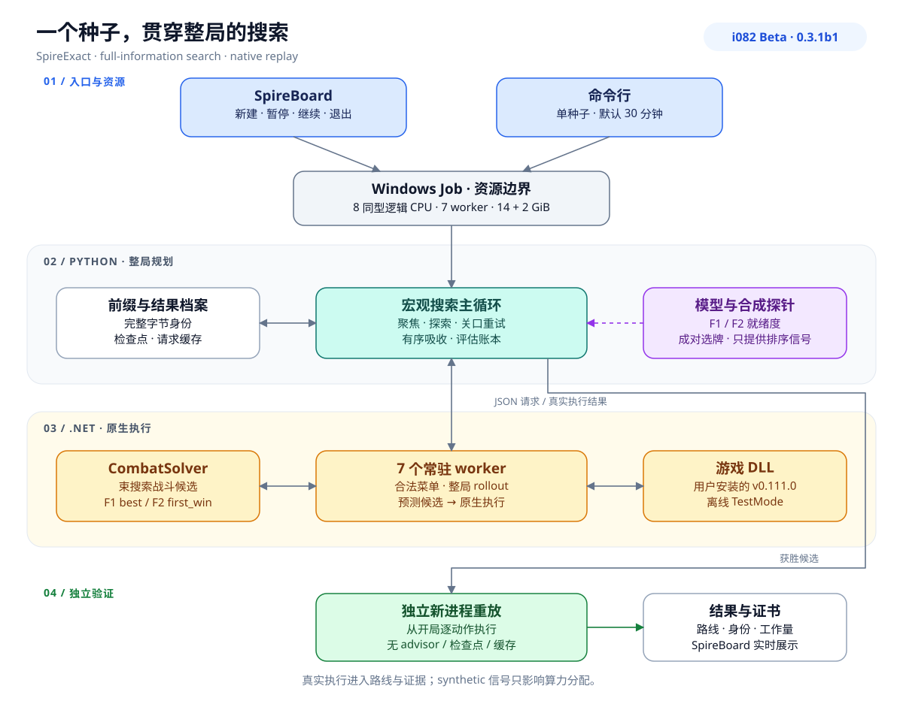
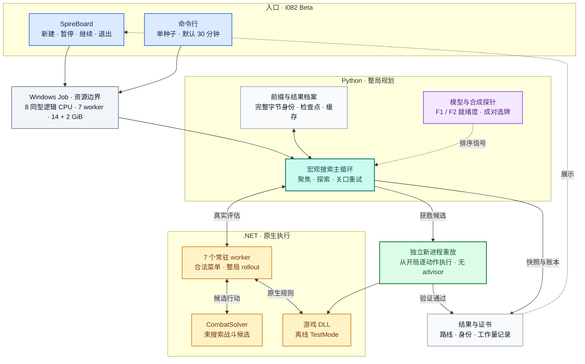

# SpireExact — i082 Beta

**给定一个 Slay the Spire 2 种子，在预算内持续搜索可完整重放的通关路线。** SpireExact 将地图、选牌、商店、休息和战斗接成整局搜索，从已执行的动作前缀不断尝试新的延续。研究设置为 IRONCLAD / Ascension 10 / all unlocks / fresh start / mode1 全信息，允许利用种子决定的未来。

本版 **Beta · 0.3.1b1** 提供 i082 规划源码、最新 SpireBoard 前端、公开依赖构建与 CLI。前端新作业和命令行均采用完整 i082 设置，默认 7 worker、30 分钟。[Beta Release](https://github.com/Luminesce4you/SpireExact/releases/tag/v0.3.1-beta.1-i082) · [完整 16 节架构说明](docs/I082_ARCHITECTURE.md) · [i082 机制与证据](docs/I082.md)

**对大部分种子，建议选择 45 分钟预算。**

## 架构与搜索流程

Python 协调器管理路线谱系、聚焦与探索、关口重试和模型信号。七个常驻 .NET worker 执行合法菜单与完整 rollout，CombatSolver 在 worker 内提供束搜索战斗候选，用户安装的游戏 DLL 执行原生规则。



<details>
<summary>查看可编辑的 Mermaid 架构图</summary>



</details>

1. **产生候选。** 从已有完整前缀的一个决策点更换选项，或安排根部策略、延续和关口重试。
2. **执行整局。** 常驻 worker 重放前缀或恢复边界检查点，继续地图、奖励、商店、休息与战斗，保存真实后继状态和工作量。
3. **安排下一批搜索。** 协调器吸收真实结果，更新档案、精英、关口模型和待办。F2 满血就绪度、成对选牌等 synthetic 探针在一次性进程执行，只提供排序信号，保持与真实路线和胜利证据分开。
4. **确认获胜路线。** 候选从初始状态在独立新进程中完整重放，使用原生终局与身份核对生成证书；SpireBoard 展示进展、模型和可核查动作。

详细文档覆盖一次评估、派发/吸收、聚焦、F1/F2 模型、战斗计划、合成信号与验证链路，并附 [源码复核记录](docs/I082_ARCHITECTURE_REVIEW.md)。

## 1. 准备与构建

准备 Windows x64、Python 3.11+、.NET 9 SDK、Git，以及自己安装的 STS2 **v0.111.0** 与完整 RitsuLib Workshop item **3747602295**。首次构建需要访问固定版本 CombatSolver 仓库和公共 NuGet 包源。

在解压目录或 Git clone 根目录打开 PowerShell：

```powershell
python --version
dotnet --version
git --version

python tools/setup_source.py `
  --game-dir "<你的游戏根目录或 data_sts2_windows_x86_64 目录>" `
  --ritsu-dir "<你的 Workshop/3747602295 目录>"

python tools/setup_source.py --check-only
```

用实际安装路径替换 `<...>`。SDK 不在 PATH 时，构建命令追加 `--dotnet "<dotnet.exe 的绝对路径>"`。工具在包内准备用户依赖，获取固定上游、应用 harness 补丁并编译宿主、solver、harness 和静态契约检查器。配置写入 `.tools/source-setup.json`，报告写入 `outputs/source-setup/`。[详细构建说明与故障处理](docs/BUILD.md)

本交付已在 Windows 下完成四项目构建，均为 0 warning / 0 error，`--check-only` 的构建与静态身份前置检查通过。[构建报告](release/BUILD_VALIDATION.json)记录本次源码与产物身份。前端还需完成下一步的本机零动作宿主初始化检查。

## 2. 打开 SpireBoard 前端

构建成功后准备本机前端入口，再启动浏览器看板：

```powershell
python tools/prepare_dashboard.py
powershell -NoProfile -File dashboard/start.ps1 -Python python -Port 8765
```

浏览器打开 [SpireBoard 本机页面](http://127.0.0.1:8765/)。点击 **新建求解**，输入种子、选择时间上限并提交，启动完整 i082 新作业。前端默认 30 分钟，支持 1–45 分钟；查看搜索进展、实时资源、关口模型和已验证的胜利轨迹。

运行页提供 **暂停求解 / 继续求解 / 退出求解**。暂停保留整棵作业进程树的内存状态，暂停时间不计求解预算；继续恢复相同进程；退出结束作业并保留已有记录。暂停用于进程仍存活时继续，机器或作业退出后不会从暂停状态重新启动。

`prepare_dashboard.py` 使用本包的当前 i082 源码和本机构建，不需要作者工作区。它校验身份并执行零动作宿主初始化，写入本机就绪记录；这一步不进行战斗或整局搜索。前端新作业保存到 `outputs/spireboard/interactive/<run-id>/`。[前端说明](dashboard/README.md) · [构建与前端准备](docs/BUILD.md)

## 3. 命令行预览与单种子搜索

先打印完整参数，再用另一个新目录启动作业：

```powershell
python tools/run_release_source.py `
  --seed 101 --out "outputs/my-i082-plan" `
  --feature-profile i082 --minutes 30 --solver-seed 271828 --workers 7 --dry-run

python tools/run_release_source.py `
  --seed 101 --out "outputs/my-i082-run" `
  --feature-profile i082 --minutes 30 --solver-seed 271828 --workers 7 --detach
```

`--dry-run` 输出完整命令与设置，不启动求解；`--detach` 启动作业后返回 PID，日志保存在输出目录同级。去掉 `--detach` 可在当前终端等待结束。`--seed` 与 `--out` 必填，输出目录必须尚未使用。省略其他参数时采用上面展示的默认值。

按推荐预算运行时，将上面的 `--minutes 30` 改为 `--minutes 45`；SpireBoard 的时间选择中也提供 45 分钟。

i082 包含聚焦调度、关口模型、多级首领计划、`pick,elo` 根部策略、牌组族上限、F1/F2 联合就绪度以及每 32 个最终幕 F1 入场触发的成对选牌探针。设置由 `spire_exact/planning/final_defaults.py` 统一解析，完整取值随作业保存。机制开启后仍需满足各自的采样、拟合和触发条件。[完整配置](docs/I082.md) · [机器可读默认值](release/i082/defaults.json)

标准作业分配 8 个同类型逻辑 CPU、14 GiB Job 工作负载和 2 GiB 预留，要求 7 个 worker，有序派发窗口为 56。资源不足以满足请求时拒绝启动；可显式用 `--workers 1` 至 `--workers 7` 选择较小配置，设置随记录保存。一次运行一个种子。`result.json` 保存搜索结果：`VERIFIED_WIN_IN_NATIVE_HOST` 表示候选已通过独立原生重放；`UNKNOWN` 表示当前预算下未获胜，保留进展与资源记录。

## 4. 当前版本与验证

规划实现来自 **`frozen-i082`**，原冻结 `source_version` 为：

```text
e1b10f6f10f1c1d27f5f176f8b4e73ce8aa07fc2a9ab94b9eaf2d9cd10bd7c74
```

iteration-082 的现有完整源码回归记录为 **845/845 通过**。本轮增加统一配置入口、成对表等距触发、内容去重、平均合并和合成加牌支接入联合模型。默认全开是当前版本的配置选择；i082 的整局效果、首胜时间与额外探针成本仍需由该版本的运行结果评估。[本轮实现与证据](release/i082/results.md) · [原测试记录](release/i082/tests.json)

公开构建适配支持从固定源码在用户目录重新编译，并保留依赖指纹与静态 CIL 契约检查。原冻结身份、本次源码包身份和重新编译的二进制身份分别记录。当前构建的胜利证书需由实际重放生成。[发布范围与方法](docs/RELEASE_SCOPE.md)

## 5. 历史结果与路线重放

本包保留旧基线 **`frozen-i054a` / holdout-01** 的研究证据：20 个新种子各运行一次、每次 30 分钟，17 个独立重放确认胜利，观察解出比例为 85%（Wilson 95% 区间 64–95%）。这是旧配置的结果，i082 的效果按自己的记录评估。[历史结果](release/holdout-01/results.md) · [20 次记录](release/holdout-01/summary.json)

17 条完整获胜动作与历史证书可用于本机构建的重放检查：

```powershell
python tools/replay_holdout_source.py `
  --route "release/holdout-01/routes/seed-2059734609/winning-route.json" `
  --out "outputs/replay-holdout-2059734609" --dry-run

python tools/replay_holdout_source.py `
  --route "release/holdout-01/routes/seed-2059734609/winning-route.json" `
  --out "outputs/replay-holdout-2059734609"
```

实际重放使用当前宿主，从初始状态在两个独立新进程中执行完整动作，通过后生成当前二进制身份下的新证书。历史证书保留原始身份。证据范围为离线 TestMode 原生 DLL 执行，正常 Godot 游戏等价仍待验证。

## 源码导航

| 路径 | 内容 |
| --- | --- |
| `spire_exact/` | Python CLI、整局搜索、调度、关口模型与进程池 |
| `spire_exact/planning/final_defaults.py` | i082 profile 默认值的统一来源 |
| `native/SpireNativeHost/` | C# 游戏原生规则宿主 |
| `tools/setup_source.py` | 依赖准备、源码构建与身份前置检查 |
| `tools/prepare_dashboard.py` | 本机 SpireBoard 身份与零动作初始化前置检查 |
| `dashboard/start.ps1` | 启动本机前端与浏览器 |
| `tools/run_release_source.py` | 本版 i082 单种子启动器 |
| `tools/replay_holdout_source.py` | 完整动作重放与本机证书生成 |
| `tools/`、`tests/` | 研究工具与回归测试 |
| `release/` | 版本身份、发布验证与精选历史证据 |
| `docs/` | 构建、i082、背景、规则与正确性说明 |
| `dashboard/` | 完整 i082 前端，支持新作业、实时观察及暂停/继续/退出 |

发行包含源码、文档、许可证和精选证据。游戏/Workshop DLL、SDK、第三方检出、缓存和运行输出由用户在本机准备。项目采用 [MIT 许可证](LICENSE)，上游及社区数据来源见 [THIRD_PARTY_NOTICES.md](THIRD_PARTY_NOTICES.md)，固定 CombatSolver 提交见 [upstream.lock.json](upstream.lock.json)。
