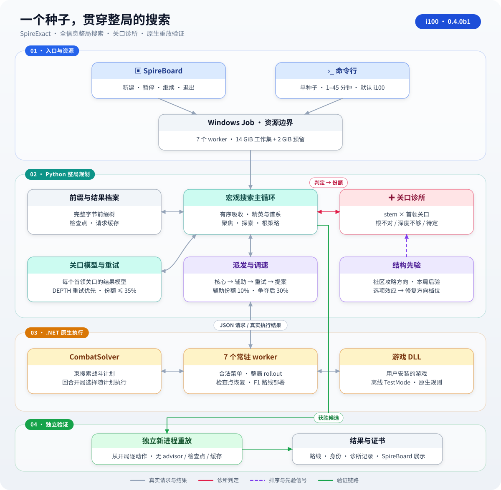
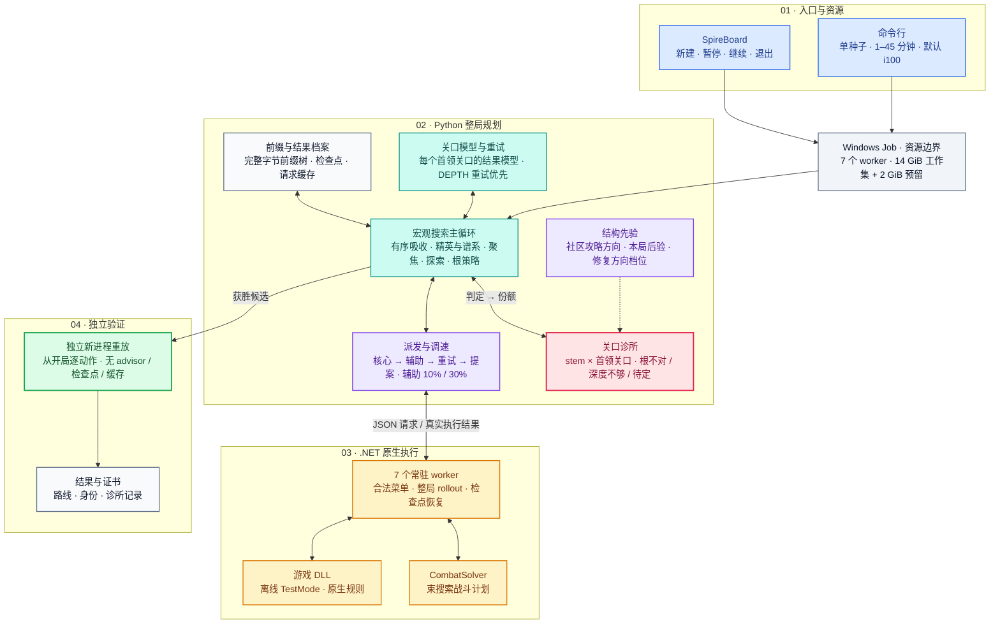
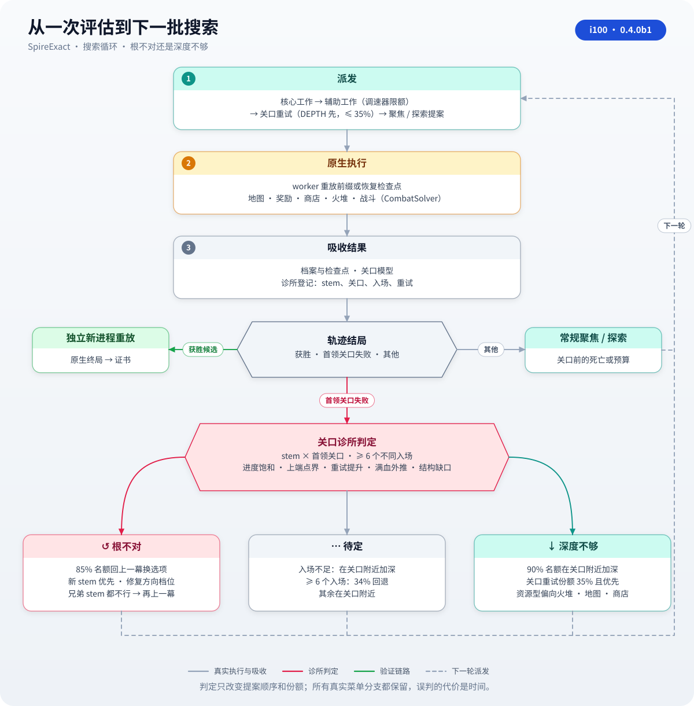
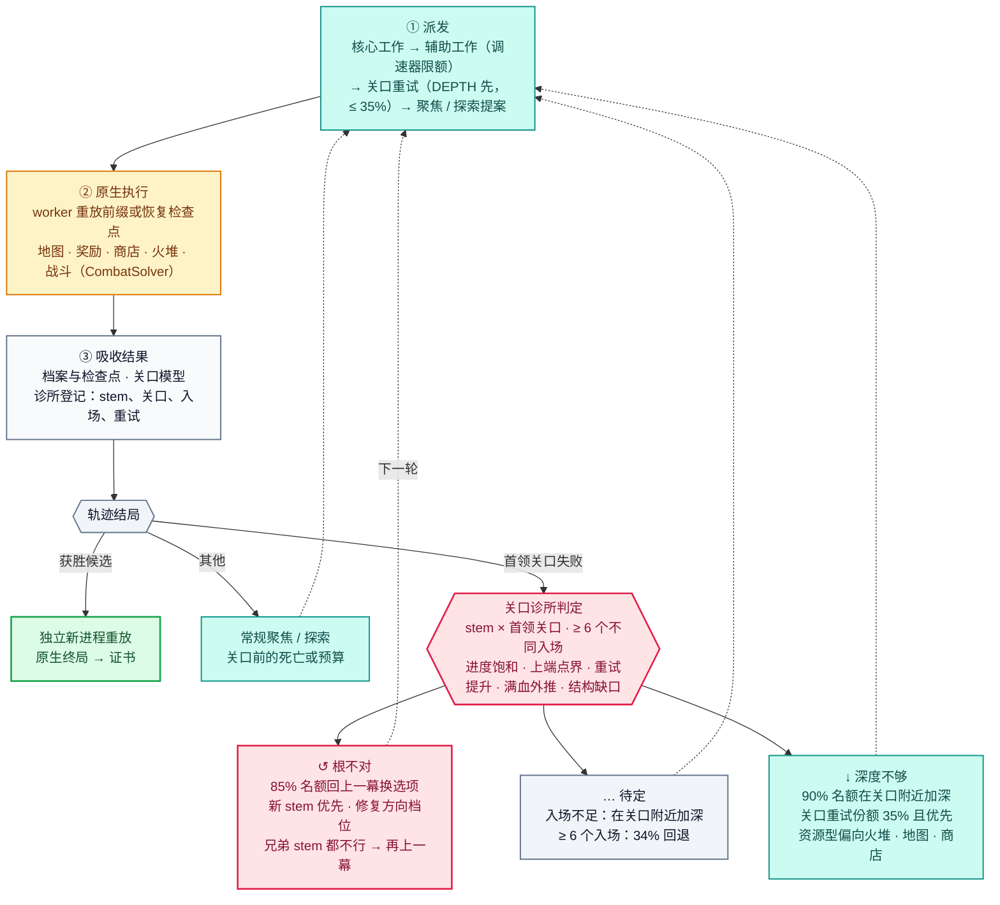

# SpireExact — i100

**给定一个 Slay the Spire 2 种子，在预算内搜索可完整重放的通关路线。** SpireExact 把地图、选牌、商店、休息和战斗接成整局搜索，从已执行的动作前缀不断尝试新的延续，用独立新进程的完整重放确认胜利。研究设置为 IRONCLAD / Ascension 10 / all unlocks / fresh start / mode1 全信息，允许利用种子决定的未来。

本版 **i100 · 0.4.0b1** 的核心是 **关口诊所**：搜索卡在某个首领关口时，先判断是"根不对"（进入这一幕之前的牌组就不够）还是"深度不够"（差一点、换更强的战斗计划或保住血量就能过），再决定回上一幕换选项，还是在关口附近加深。SpireBoard 前端、发布启动器和规划器命令行默认使用 i100；i082、i085 仍可通过 `--feature-profile` 选择。

[i100 设计与结果](docs/I100.md) · [评估数据](release/i100/results.md) · [构建说明](docs/BUILD.md) · [i082 完整架构说明](docs/I082_ARCHITECTURE.md)

**建议 45 分钟预算。**

## 架构



<details>
<summary>可编辑的 Mermaid 架构图</summary>



</details>

- **入口与资源**：SpireBoard 和命令行在 Windows Job 里启动作业，7 个 worker，14 GiB 工作集加 2 GiB 预留。
- **Python 整局规划**：主循环维护完整字节前缀树、检查点和缓存，从精英轨迹的决策点产生新提案。关口诊所给每个"进入该幕前的非战斗决策序列（stem）× 首领关口"下判定；结构先验和本局学到的选项效应决定回退时先试哪些选项；派发与调速保证核心搜索优先，路线、锻造、F1 赢家路线复用等辅助工作按份额插入。
- **原生执行**：常驻 worker 用游戏 DLL 执行合法菜单与完整 rollout，CombatSolver 用束搜索规划战斗，包括后续回合开局的选择。
- **独立验证**：获胜候选在新进程中从开局逐动作重放，观察到原生胜利后生成证书。

## 搜索流程



<details>
<summary>可编辑的 Mermaid 流程图</summary>



</details>

1. **派发**：每轮先派核心工作，辅助工作按调速器份额插入（关口尚无争夺时 10%，之后 30%，被压住的项原位排队）；有"深度不够"关口的重试时，关口重试份额提到 35% 并排在前面；剩余名额给聚焦与探索提案。
2. **原生执行**：worker 重放前缀或从地图检查点恢复，完成地图、奖励、商店、火堆与战斗，返回完整轨迹和工作量。
3. **吸收结果**：结果按序进入档案、检查点、关口模型和诊所。诊所记录每个 (stem, 关口) 的不同入场、战斗进度、关口重试的提升和入场血量。
4. **诊所判定**：入场达到 6 个后，依据进度是否饱和、上端点界能否够到过关、更强计划能否提升、外推到满血能否过关、结构缺口大小，判为根不对、深度不够或待定。
   - **根不对**：该轨迹 85% 的聚焦名额回到上一幕换选项，优先形成新的 stem，并给后续 rollout 附上修复缺口的选牌方向；同一父 stem 下多个兄弟 stem 都过不去时，再退一幕。
   - **深度不够**：90% 名额留在关口附近，关口重试优先；资源型（血量决定成败）偏向火堆、地图和商店选项。
   - **待定**：入场不足时在关口附近加深；入场足够但证据不一致时 34% 回退。
5. **验证**：获胜候选进入独立新进程完整重放，生成证书。

判定只改变提案的先后和份额，所有真实菜单分支都保留在前缀树里。完整的判定规则、证据阈值和每条证据的含义见 [docs/I100.md](docs/I100.md)。

## i100 的变化

| 方向 | 内容 |
| --- | --- |
| 关口诊所 | 按 stem × 首领关口诊断根不对 / 深度不够，取代 i082 的"同一谱系 32 次失败就暂停"计数回退 |
| 回退更有方向 | 回到上一幕时新 stem 优先；按本局学到的选项效应修复结构缺口；兄弟 stem 都不行时再退一幕 |
| 深度型关口 | 关口重试份额 35% 并优先派发；资源型偏向保血选项 |
| 派发调速 | 辅助工作（路线、锻造、F1 赢家复用、真实选牌菜单）按份额插入，核心搜索不再被排队挤占 |
| 社区攻略先验 | 只编码跨攻略一致的方向（扩展来源、双首领连战的血量、持续防御、精简牌组、升级），落在原生实时计算的结构特征上，不含卡名、遗物名，游戏更新后不需要改代码；本种子的真实首领结果会覆盖先验 |
| 精简 | i081/i082 的合成 F2 机制（满血就绪度、联合模型、联合聚焦、DEAD 后放、成对选牌表）默认关闭，每项都可单独打开 |
| 修复 | 带回合开始选牌遗物（如 TOASTY_MITTENS）时，F2 开场选牌不再让 F1 赢家路线复用报错；上一场残留的选择不会带进下一场；关口重试结果按正确的入场归属 |
| 协调器 | F2 就绪度只读视图缓存，消除 F1/F2 阶段的深拷贝热点 |

## 评估

评估用合成战役世界驱动真实的规划主循环：三幕构筑战役，最终幕双首领，七类隐藏结构（简单、战术、资源、根在第二幕、根在第一幕、混合、不可解）。真实派发、吸收、诊所、关口重试和独立重放校验都按原代码运行，worker 池用模拟时钟。所有调参只用开发面板；下面是代码冻结后在 80 个留出世界 × 2 个 solver seed 上的结果（每个配置 160 次运行，其中 4 次为不可解对照）。

| 配置 | 30 分钟解出 | 45 分钟解出 | 受限平均时间（45 分钟） | 与 i100 的配对差（95% 区间） |
| --- | ---: | ---: | ---: | --- |
| **i100** | **154 / 160** | **156 / 160** | **607 s** | — |
| i054a（holdout-01 配置） | 156 / 160 | 156 / 160 | 659 s | +52 s [−3, +104] |
| i082 | 145 / 160 | 156 / 160 | 746 s | +139 s [+89, +195] |
| i085 | 142 / 160 | 155 / 160 | 755 s | +148 s [+90, +208] |
| i085 tail | 151 / 160 | 156 / 160 | 642 s | +34 s [−32, +103] |

- 混合面板（40 个世界，其中 16 个简单世界）上 i100 比 i082 快 104 s、比 i054a 快 98 s；简单世界平均 316 s，i082 为 355 s，i054a 为 376 s。
- 长尾面板上 i100 比 i082 快 173 s，与 i054a 持平；i082 和 i085 在长尾上比 i054a 慢约 170–190 s，i100 把这部分损失补了回来。
- 去掉关口诊所平均慢 61 s [+11, +114]；打开 i081 合成 F2 机制平均慢 18 s，且有 2 次在 45 分钟内未解出。

分类结果、全部消融、开发过程和原始数据见 [release/i100/results.md](release/i100/results.md)。本机原生 A/B 用 `tools/benchmark_i085.py` 和[分层面板](release/i100/native-panel.json)运行，命令见 [docs/I100.md](docs/I100.md#7-本机-windows-原生验证)。

## 1. 准备与构建

准备 Windows x64、Python 3.11+、.NET 9 SDK、Git，以及自己安装的 STS2 **v0.111.0** 与完整 RitsuLib Workshop item **3747602295**。首次构建需要访问固定版本 CombatSolver 仓库和公共 NuGet 包源。

在解压目录或 Git clone 根目录打开 PowerShell：

```powershell
python --version
dotnet --version
git --version

python tools/setup_source.py `
  --game-dir "<你的游戏根目录或 data_sts2_windows_x86_64 目录>" `
  --ritsu-dir "<你的 Workshop/3747602295 目录>"

python tools/setup_source.py --check-only
```

用实际安装路径替换 `<...>`。SDK 不在 PATH 时，构建命令追加 `--dotnet "<dotnet.exe 的绝对路径>"`。工具在包内准备用户依赖，获取固定上游、应用 harness 补丁，编译宿主、solver、harness 和静态契约检查器。配置写入 `.tools/source-setup.json`，报告写入 `outputs/source-setup/`。从旧版本更新到 i100 时，原生宿主源码有更新，需要重新运行一次上面的构建命令，再运行下一步的 `prepare_dashboard.py`。[详细构建说明与故障处理](docs/BUILD.md)

## 2. 打开 SpireBoard 前端

构建成功后准备本机前端入口，再启动浏览器看板：

```powershell
python tools/prepare_dashboard.py
powershell -NoProfile -File dashboard/start.ps1 -Python python -Port 8765
```

浏览器打开 [SpireBoard 本机页面](http://127.0.0.1:8765/)。点击 **新建求解**，输入种子、选择时间上限并提交，启动 i100 新作业。前端默认 30 分钟，支持 1–45 分钟；页面展示搜索进展、实时资源、关口模型和已验证的胜利轨迹。

运行页提供 **暂停求解 / 继续求解 / 退出求解**。暂停保留整棵作业进程树的内存状态，暂停时间不计入求解预算；继续恢复同一进程；退出结束作业并保留已有记录。

`prepare_dashboard.py` 绑定本包的当前源码和本机构建，校验身份并执行一次零动作宿主初始化，写入本机就绪记录。前端新作业保存到 `outputs/spireboard/interactive/<run-id>/`。[前端说明](dashboard/README.md)

## 3. 命令行单种子搜索

先打印完整参数，再用另一个新目录启动作业：

```powershell
python tools/run_release_source.py `
  --seed 101 --out "outputs/my-i100-plan" --minutes 45 --dry-run

python tools/run_release_source.py `
  --seed 101 --out "outputs/my-i100-run" --minutes 45 --detach
```

`--dry-run` 输出完整命令与设置；`--detach` 启动作业后返回 PID，日志保存在输出目录同级，去掉它则在当前终端等待结束。`--seed` 与 `--out` 必填，输出目录必须是新的。默认 i100、7 个 worker、solver seed 271828；`--feature-profile i082` 或 `i085` 切换到旧版本配置，`--extra` 之后的参数可覆盖单项设置（例如 `--extra --f2-readiness-probes`）。

i100 的全部取值由 `spire_exact/planning/final_defaults.py` 统一解析，随作业写入清单。[机器可读默认值](release/i100/defaults.json)

`result.json` 保存搜索结果：`VERIFIED_WIN_IN_NATIVE_HOST` 表示候选已通过独立原生重放；`UNKNOWN` 表示预算内未获胜，进展与资源记录保留。`search_metrics.gate_clinic` 列出每个 (stem, 关口) 的入场数、最好进度、判定、证据、回退与局部名额，可以直接看到搜索认为卡点是根不对还是深度不够、依据是什么。

## 4. 历史结果与路线重放

本包保留 **`frozen-i054a` / holdout-01** 的研究证据：20 个新种子各运行一次、每次 30 分钟，17 个经独立重放确认胜利（解出比例 85%，Wilson 95% 区间 64–95%）。[历史结果](release/holdout-01/results.md) · [20 次记录](release/holdout-01/summary.json)

17 条完整获胜动作与历史证书可用于本机构建的重放检查：

```powershell
python tools/replay_holdout_source.py `
  --route "release/holdout-01/routes/seed-2059734609/winning-route.json" `
  --out "outputs/replay-holdout-2059734609" --dry-run

python tools/replay_holdout_source.py `
  --route "release/holdout-01/routes/seed-2059734609/winning-route.json" `
  --out "outputs/replay-holdout-2059734609"
```

重放使用当前宿主，从初始状态在两个独立新进程中执行完整动作，通过后生成当前二进制身份下的新证书；历史证书保留原始身份。

## 源码导航

| 路径 | 内容 |
| --- | --- |
| `spire_exact/planning/` | 整局搜索、调度、关口模型、进程池 |
| `spire_exact/planning/gate_clinic.py` | 关口诊所：stem × 首领关口的根不对 / 深度不够判定 |
| `spire_exact/planning/clinic_focus.py` | 按判定分配回退与局部名额、修复方向档位 |
| `spire_exact/planning/strategy_priors.py` | 版本无关的结构先验与本局选项效应 |
| `spire_exact/planning/aux_governor.py` | 辅助工作派发份额 |
| `spire_exact/planning/final_defaults.py` | i100 / i082 / i085 各 profile 默认值的统一来源 |
| `native/SpireNativeHost/` | C# 游戏原生规则宿主与战斗 advisor |
| `tools/setup_source.py` | 依赖准备、源码构建与身份前置检查 |
| `tools/prepare_dashboard.py` | 本机 SpireBoard 身份绑定与零动作初始化 |
| `tools/run_release_source.py` | 单种子启动器（默认 i100） |
| `tools/benchmark_i085.py` | 原生配对基准：计划、串行运行、报告 |
| `tools/sim_campaign.py`、`tools/final01_sim_study.py` | 合成战役世界与配对评估工具 |
| `tools/replay_holdout_source.py` | 完整动作重放与本机证书生成 |
| `dashboard/` | SpireBoard 前端：新作业、实时观察、暂停 / 继续 / 退出 |
| `release/` | 各版本身份、默认值、评估与历史证据 |
| `docs/` | 构建、设计、规则与正确性说明 |

发行包含源码、文档、许可证和精选证据。游戏 / Workshop DLL、SDK、第三方检出、缓存和运行输出由用户在本机准备。项目采用 [MIT 许可证](LICENSE)，上游及社区数据来源见 [THIRD_PARTY_NOTICES.md](THIRD_PARTY_NOTICES.md)，固定 CombatSolver 提交见 [upstream.lock.json](upstream.lock.json)。
