# i082 Beta 架构说明：项目架构与搜索逻辑

本文说明 i082 的整局规划、原生执行、合成信号与独立重放链路，保留 16 节详细导航。规划实现来自原冻结 `frozen-i082`，源码版本 `e1b10f6f10f1c1d27f5f176f8b4e73ce8aa07fc2a9ab94b9eaf2d9cd10bd7c74`；公开构建与前端适配按自己的身份记录。

公开入口默认叠加 30 分钟、7 worker、有序派发等运行设置，支持 1–45 分钟；作者建议大部分种子选择 45 分钟。`--feature-profile i082` 统一选择功能项，运行预算另由启动器明确设置。构建、SpireBoard 新建/暂停/继续/退出和命令行用法见 [README](../README.md)、[BUILD](BUILD.md)与[前端说明](../dashboard/README.md)。

胜利证据覆盖离线 TestMode 原生游戏 DLL 执行，并在新进程中从开局完整重放确认。模型、先验与探针用于分配算力，预算下未解出保留 UNKNOWN；正常 Godot 游戏等价独立验证。[源码复核与修正记录](I082_ARCHITECTURE_REVIEW.md)

原 16 节文档 SHA-256：`ed4040077bf4c8c7051e739725a27dc73b90f8abb9bd7e9f8598d6c9de077f7a`。本公开副本修正运行路径、30 分钟设置与源码复核发现的条件，原文和冻结源码继续保留。

## 目录

1. 一句话概览
2. 项目架构图
3. 一次评估的生命周期
4. 运行产物与 SpireBoard
5. 搜索逻辑总图（主循环）
6. 派发：每个空位先给谁
7. 吸收：一个结果回来以后做什么
8. 聚焦调度器
9. 关口模型、联合表与档位
10. 战斗层：关口计划与重试
11. 合成信号：F2 就绪度与选牌对照表
12. 提案类工作：F1 赢法复用、路线与准备、内存前缀
13. 胜利验证
14. 参数速查（完整 i082 命令行）
15. 关键文件索引
16. 不变量：改代码时不能破坏的规则

---

## 1. 一句话概览

问题是 IRONCLAD、Ascension 10、all unlocks、fresh start、mode1 全信息（可以利用种子决定的未来），只看整局胜负 0/1。

求解器分三层：

| 层 | 在哪里 | 做什么 |
|---|---|---|
| 宏观搜索 | Python 协调器（`spire_exact/planning`） | 决定"从哪条已执行轨迹的哪个决策点换一个选项再跑一遍"，派任务、收结果、维护模型和队列 |
| 整局执行 | 7 个常驻 .NET worker（`native/SpireNativeHost`） | 用真实游戏 DLL 从一个动作前缀继续跑整局 rollout，非战斗决策由原生策略 + 下发的档位决定 |
| 战斗 | worker 内的 `BeamAdvisor` → vendor CombatSolver | 每场战斗做束搜索，首领 / 精英按多成员"关口计划"搜 |

搜索的基本单位叫**评估**：一个动作前缀 + 从前缀末尾一直跑到死亡或胜利的一次 rollout（lookahead 99 层、12,000 个动作，实际等于跑完整局）。找到候选胜利后，在全新进程里不带 advisor、检查点、缓存，从初始状态逐动作重放，观察到原生 `OnEnded(true)` 才算胜利。

---

## 2. 项目架构图


<details>
<summary>查看可编辑的 Mermaid 架构图</summary>

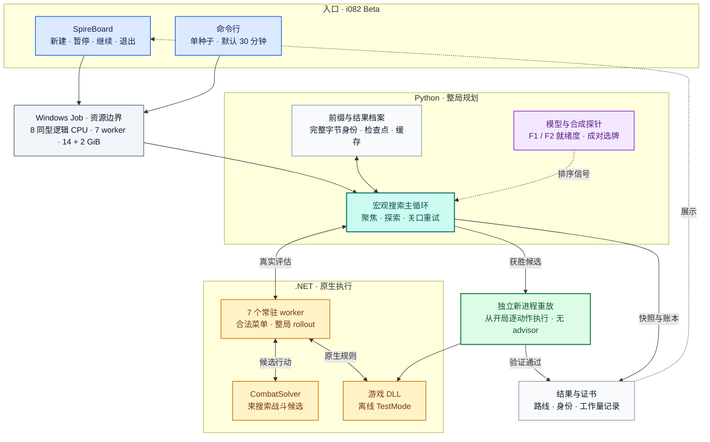

</details>

各块的职责：

| 块 | 主要文件 | 职责 |
|---|---|---|
| 启动 | `tools/run_release_source.py`、`tools/prepare_dashboard.py`、`dashboard/manual_runner.py` | 公开启动器与前端准备绑定本包源码/宿主；写 manifest（协议、种子、`solver_seed`、身份、完整参数），研究工具保留独立冻结/队列用法 |
| 资源边界 | `tools/limited_cli.py`、`planning/resources.py` | Windows Job 限 CPU、内存与主动时间；`ResourcePlan.detect` 读真实 Job 上限，公开入口要求满足请求 worker 数，否则拒绝启动 |
| 协调器 | `planning/__main__.py`、`planning/search.py` | 组装配置和 advisor，跑主循环；确定性取样由 `solver_seed` 派生，非就绪度结果按提交序号吸收；就绪度完成即收及时间/资源事件也会影响路径 |
| 调度 | `focus.py`、`indexed_strategy.py`、`strategy.py`、`lineage.py` | 决定下一个宏观偏离：3 份给"走得最远的轨迹"，1 份给全树探索器；卡住时按谱系回退到上一幕 |
| 信号 | `gatemodel.py`、`f2_joint_model.py`、`f2_readiness.py`、`paired_card_probes.py`、`policies.py` | 本种子在线学到的关口模型、联合表、合成就绪度、选牌对照表、根策略档位表 |
| 提案 | `repairs.py`、`gates.py`、`f1_winners.py`、`preparation.py`、`memory_prefix.py` | 关口重试、F1 赢法复用、路线与准备、内存中断后的前缀续跑 |
| 存档 | `archive.py` | 按完整前缀的检查点 trie（1024 MiB）、按完整请求的结果缓存（128 MiB）、多样性前沿（256 条）、`utility` 排序 |
| 进程池 | `pool.py` | 常驻 worker、一次性探针进程、一次性验证进程；核对 worker 二进制身份 |
| 原生宿主 | `native/SpireNativeHost/*.cs` | 在真实游戏代码里执行动作、列合法菜单、跑战斗搜索、写证据和检查点 |
| 前端 | `dashboard/` | SpireBoard：提交完整 i082 新作业、暂停/继续/退出，展示运行、关口模型和验证路线 |

---

## 3. 一次评估的生命周期

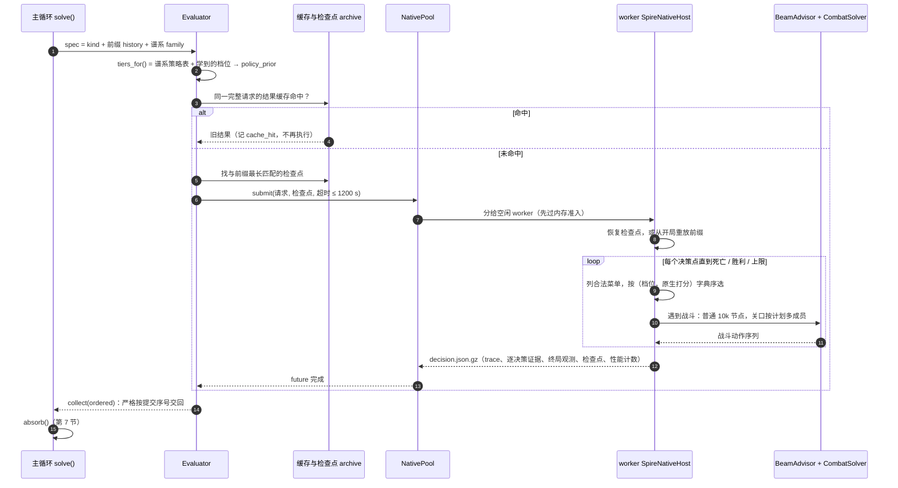

请求里除了前缀，还带：

- `policy_seed`：由 `sha256(solver_seed:policy)` 派生；
- `policy_prior`：本次请求的档位表（第 9 节），只给"生成新候选"的请求，在派发那一刻按已吸收的全部结果取样；
- `advisor`：战斗搜索配置（节点预算、关口计划、`prefer_f1_hp`、`fix_consumed_block_compensation` 等）；
- 采集开关：`capture_checkpoints`、`include_campaign_metadata`、`capture_f1_winners`、`capture_route_graph`、`capture_resource_telemetry`、`capture_preparation_menus`、`memory_telemetry`、`preserve_completed_prefix`，以及研究进度契约 `research_progress`。

两类请求的走法不同：

- **普通评估**（偏离、续跑、关口重试、重启）：走常驻 worker、结果缓存和检查点，结果进检查点档案。
- **隔离消费者**（F1 赢法复用、路线计划、内存前缀续跑）：一次性新进程、不用检查点、不进缓存、不重新取档位；原生宿主先核对研究进度契约，不符就记为 UNKNOWN。

---

## 4. 运行产物与 SpireBoard

公开前端新作业的目录：

```text
outputs/spireboard/interactive/<run-id>/
├─ validation-manifest.json        协议、种子、solver_seed、源码/宿主身份、完整参数
├─ control.json · process.json · launch-state.json · pause-ledger.json
├─ manual-request.json · events.jsonl · console.log · baseline-report.json
├─ seed-<种子>-events.jsonl · seed-<种子>-resources.json
└─ seed-<种子>/
   ├─ result.json                   运行快照，每 7 条记录刷新，运行中保留最近 64 条
   ├─ evaluations.jsonl             完整评估账本，只追加
   ├─ eval-NNNN-<kind>/             请求、原生输出与工作量
   ├─ advisor-provenance.json
   ├─ verify-eval-NNNN-*/           独立重放
   ├─ certificate.json              验证胜利时
   └─ winning-route.json            验证胜利时
```

CLI 使用用户指定的新 `--out` 目录，旁边保存启动 manifest 与日志。目录组织与界面索引属于公开启动适配，搜索核心接收实际输出路径。

`result.json` 的 `search_metrics` 保存调度、派发种类、`f2_readiness`、`paired_card_probes`、准备提案、F1 赢法复用、研究费用与内存诊断；`gate_models` 保存关口与联合模型快照。

SpireBoard 提供 **新建求解、暂停、继续与退出**，使用 prepare 生成的本机源码/宿主就绪绑定。文件变化经 SSE 推送到页面；结果面板读取已保存记录，不重新拟合模型。前端暂停冻结所属 Job 的存活进程，暂停时间从主动预算中排除，退出保留文件但结束进程。

- 运行概览：里程碑、进度和资源。
- 关口模型：各关口入场、系数及已保存的合成信号。
- 胜利轨迹：跟打与证据核查，完整原生身份和重放检查通过后展示。

---

## 5. 搜索逻辑总图（主循环）

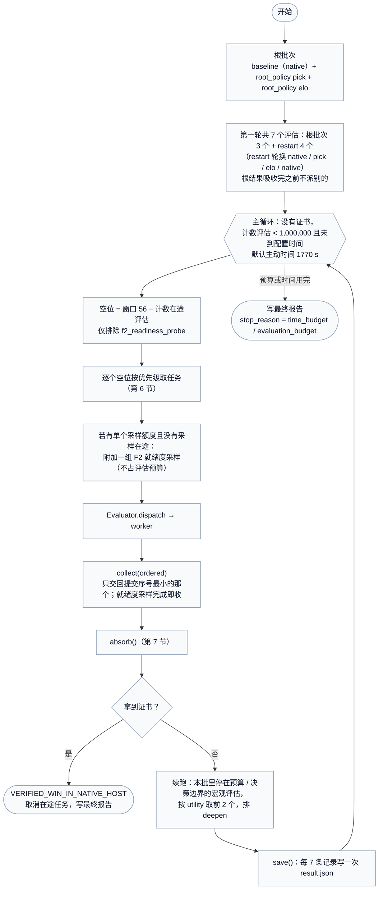

要点：

- **有序吸收**：非就绪度任务按提交序号交回，窗口 56 为 7 个 worker 提供待办空间。F2 就绪度允许完成即收并更新信号，时间与资源事件也会影响路径，比较时核对完整账本与资源条件。
- **时间**：公开启动器默认搜索 1770 s、Job 主动预算 1800 s；选择 45 分钟时分别为 2670 s、2700 s。单个任务上限 1200 s。接入暂停账本时，搜索、支持的 Evaluate 计时与 Job 超时均排除暂停时间，另记录原始墙钟；CLI 没有暂停账本时按实际运行时间限额。
- **评估预算**：`allocation_serial` 与窗口只排除 `f2_readiness_probe`，`paired_card_probe` 等其他合成批仍计入。

---

## 6. 派发：每个空位先给谁

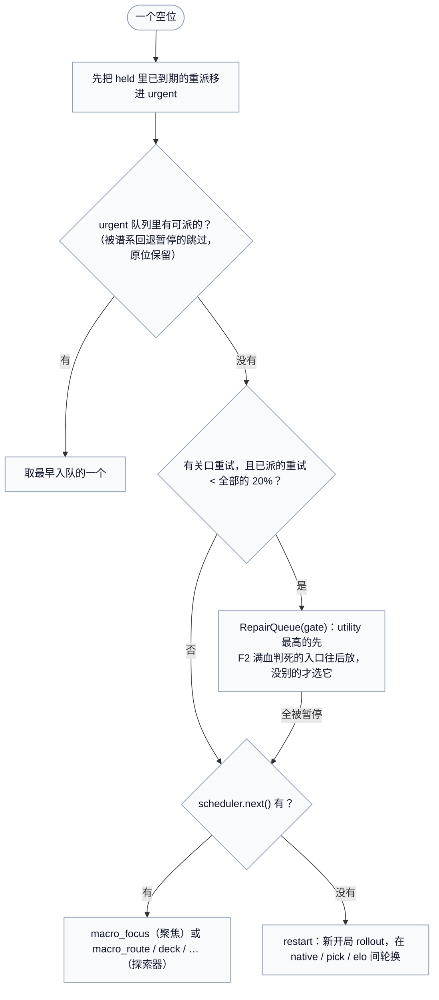

`urgent` 是先进先出队列，装的是"已经知道要做"的工作：

| kind | 来源 | 说明 |
|---|---|---|
| `baseline`、`root_policy`、`restart` | 根批次 | 只在开头 |
| `deepen` | 主循环 | 停在边界的宏观评估接着跑 |
| `paired_card_probe` | 选牌对照表 | 合成，一次性进程（第 11 节） |
| `f1_winner_reuse` | F1 赢法复用 | 隔离消费者（第 12 节） |
| `macro_shop_route`、`macro_low_hp_route` | 路线提案 | 隔离消费者 |
| `macro_forge` | 第三幕锻造备选 | 普通评估 |
| `memory_prefix_followup` | 内存中断恢复 | 隔离消费者 |
| 重派的评估 | requeue_lost | 内存准入被拒等 10 s；单任务内存预算被杀则战斗节点减半；每个提议最多重派 1 次 |

宏观评估的请求：前缀 = 偏离点之前的完整动作序列 + 换上的那个选项，`policy=0`，跑到 `层数 + 99` 或 12,000 个动作。

---

## 7. 吸收：一个结果回来以后做什么

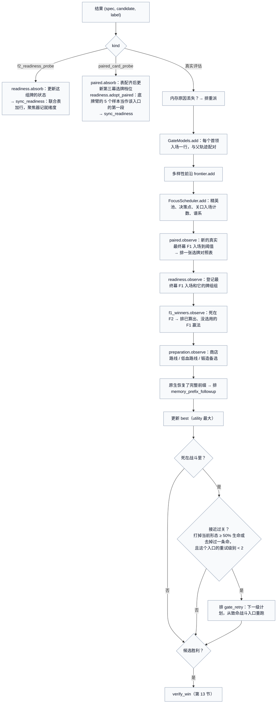

合成结果走独立吸收分支，只更新就绪度、联合表与档位等分配信号，不作为真实轨迹加入关口真实行、检查点、缓存或精英前沿。

---

## 8. 聚焦调度器

`FocusScheduler`（`focus.py`）把 3 份评估给"走得最远的轨迹"，1 份给全树探索器。

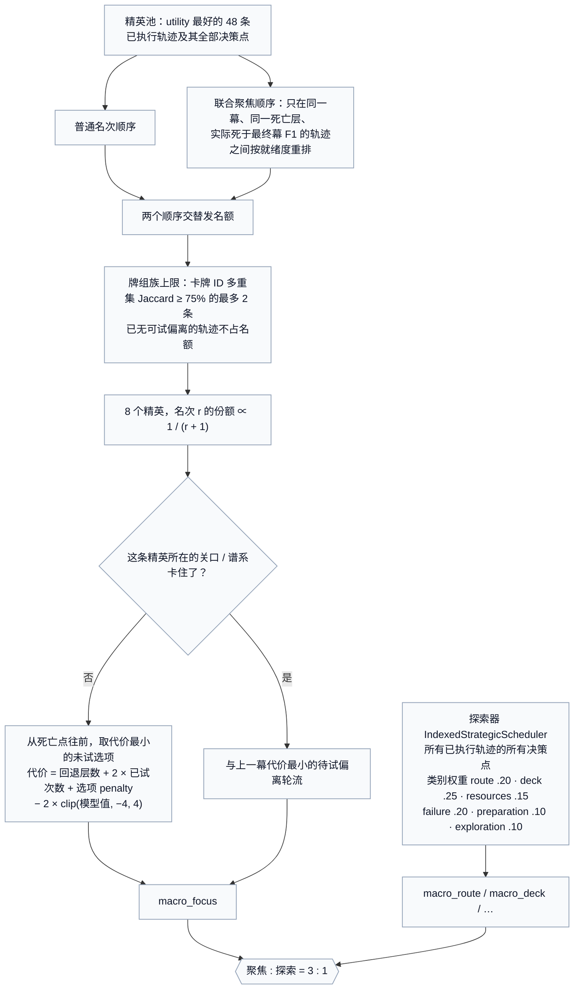

细节：

- **utility**（`archive.py`）：胜利 > 仍存活 > 死亡；死亡之间按幕、层、致命战斗里打掉的敌方生命（已击倒形态数、当前形态比例）排。它只排序，不是界。
- **偏离代价**：`use_potion` 的 penalty 为 6，其他为 0；模型值先截到 [−4, 4]，平局再按决策索引与原选项位置等字段排序。
- **决策点身份**：前缀树 `PrefixTrie` 按完整规范化动作字节去重，不用哈希、不用特征。
- **联合聚焦顺序**：只在实际死于 F1 的同幕、同层轨迹里，VIABLE（按就绪度均值从高到低）→ PENDING / UNKNOWN → DEAD_AT_FULL_HP。池、族上限、名次份额不变，只换同层轨迹的先后。
- **卡住回退**（阈值 32，按不同入场数计，同一入场的重试不算新入场；用尝试次数，不用秒数或节点数）：
  - 基本规则：最远到达的关口是第二幕首领或最终幕 F1，有 ≥ 32 个不同入场且 0 次过关时，死在这一幕的精英的聚焦挑选在常规挑法和"上一幕里代价最小的待试偏离"之间轮流。上一幕没有候选时用常规挑法。
  - 谱系扩展：谱系 = 第三幕之前的真实非战斗决策序列（含第二幕首领奖励）。按谱系统计第二幕首领和最终幕 F1 的卡住；卡住谱系的第三幕工作暂停（留在原队列，不删除），每隔一次聚焦挑选优先第三幕前没见过的决策；从回退分支到达的第二幕首领也要自己攒够 32 个失败入场，才再退回第一幕。
  - F2：最终幕 F2 的不同入场也计数，并同样触发谱系回退。
  - 任何一次过关就解除。全部是分配，没有分支被排除。
- **探索器**：按类别权重和（幕，层，阶段）访问计数取下一个分支，分桶堆，不线性扫描；`site_cap 12` 让很宽的菜单延后。

---

## 9. 关口模型、联合表与档位

关口编号是（幕，首领序号）：`(0,0)` 第一幕首领，`(1,0)` 第二幕首领，`(2,0)` 最终幕 F1，`(2,1)` 最终幕 F2。

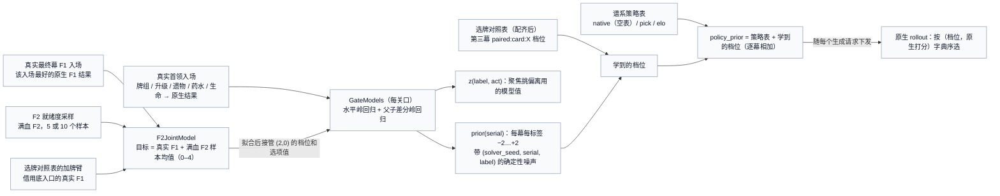

- **关口模型**（`gatemodel.py`）：每个真实首领入场记录入场状态和原生结果。没过关记"打掉的敌方生命 ÷ 该关口见过的最大生命总量"，过关记 1 + 剩余生命比例；每次拟合重算分母。水平模型回归结果对入场状态；差分模型回归"子轨迹 − 父轨迹"的结果对状态差，抵消两者共有的部分。只用本次运行自己的数据，不跨种子训练；模型快照随运行保存。
- **联合表**（`f2_joint_model.py`）：基础行对应真实最终幕 F1 入场；i082 还加入完整成对表的合成加牌行，借用基础真实 F1 结果。模型行数包含合成行与共享样本，不等于独立真实入场数。目标 = 真实 F1 结果 + 满血合成 F2 样本的均值，两关各用各的生命刻度。拟合后，`(2,0)` 的档位和选项值改由联合表给；`(2,0)` 的真实行照常收集和拟合，只是不再出档位。合成结果从不进真实关口的回归行。
- **档位合成**：`policy_prior` = 谱系的策略表 + 学到的档位。学到的档位 = 关口模型的 `prior(serial)` 合并选牌对照表的第三幕档位。合并时逐幕截到 ±8（`policies.LIMIT`），原生宿主拒收超出 ±8 的档位。原生 rollout 先比档位，档位相同再比原生打分，所以档位决定先后，从不改变合法性。
- **根策略**：`native` 是空表；`pick`、`elo` 由 `tools/build_policy_tiers.py` 从社区统计生成到 `policy_data.py`（不要手改）。一条谱系从根到所有派生评估都沿用自己的表，用来造出不同的牌组族。

---

## 10. 战斗层：关口计划与重试

战斗都在 worker 内由 `BeamAdvisor` 调 CombatSolver 束搜索，节点预算是实际约束，毫秒上限只作保险。

| 场合 | 计划 | 选法 | 门槛 |
|---|---|---|---|
| 普通战斗 | `normal_nodes 10000` | — | — |
| 精英 | E45 → E68 → E135（每个成员 120k 节点） | `first_win` | 第一个成员没赢、没去掉一条命、敌方剩余 > 50% 时后面不跑 |
| 第一、二幕首领 | E45 / E68 / E135 / E270 | `auto` → `first_win`，获胜即停 | 同上 |
| 最终幕 F1（`FinalBoss`，open） | E45 / E68 / E135 / E270 | `auto` → `best`，比较获胜成员 | 无首成员失败升级门槛 |
| 最终幕 F2（`FinalBoss`，open） | E45 / E68 / E135 / E270 | `auto` → `first_win`，获胜即停 | 无首成员失败升级门槛 |
| 关口重试第 1 级 | E90、E203（所有房间） | F1 为 best，其他 first_win | — |
| 关口重试第 2 级 | E405 | 单成员 | — |

（E45 = Evaluate 模式、束宽 45。`escalate-evaluate` 预设去掉了原 `escalate` 重试计划里的 Coordinator 成员，因为它们的物理计时器不能暂停。）

- `prefer_f1_hp`：最终幕 F1 有多个成员赢时，选预测带出生命最高的；F1 赢法复用的候选也按它排。
- 关口重试：死在战斗里、且接近过关（打掉当前形态 ≥ 50% 生命或去掉过一条命）时，从致命战斗入口的完整前缀重跑，换下一级计划。每个入口最多 2 级（按前缀树节点识别入口），重试占全部评估最多约 20%。重试的计划不带 `FinalBoss` 键。
- F2 判死后放：重试的入口若是 F2 满血 10 场全输的牌组（DEAD_AT_FULL_HP），先选别的重试；没有别的才选它。不删除。
- 其他 advisor 参数：`nodes 60000`、`profile Low`、`dop 1`、`budget_ms` / `boss_budget_ms` 600000（保险上限）、`fix_consumed_block_compensation`。

一次失败的计划不证明这场战斗打不过。

---

## 11. 合成信号：F2 就绪度与选牌对照表

合成探针让真实路线还没到的战斗（满血打 F2、加一张牌再打 F2）先打几场，给分配提供信号。

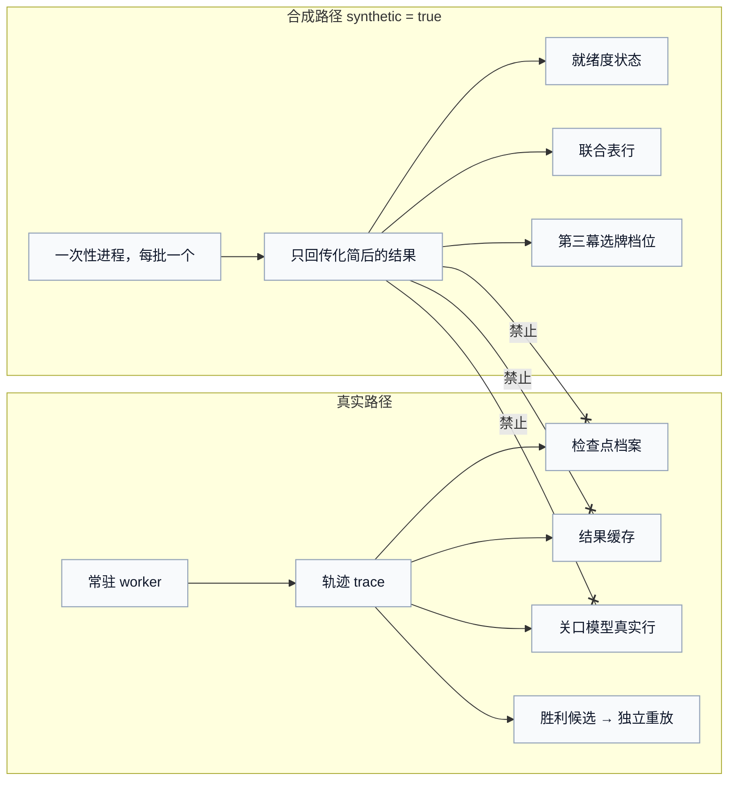

### 11.1 F2 就绪度（`f2_readiness.py`）

对每个真实的最终幕 F1 入场（按完整入场前缀识别），在 F1 前的地图边界改成满血，直接进 F2 打，判断这副牌"满血打 F2 有没有希望"。

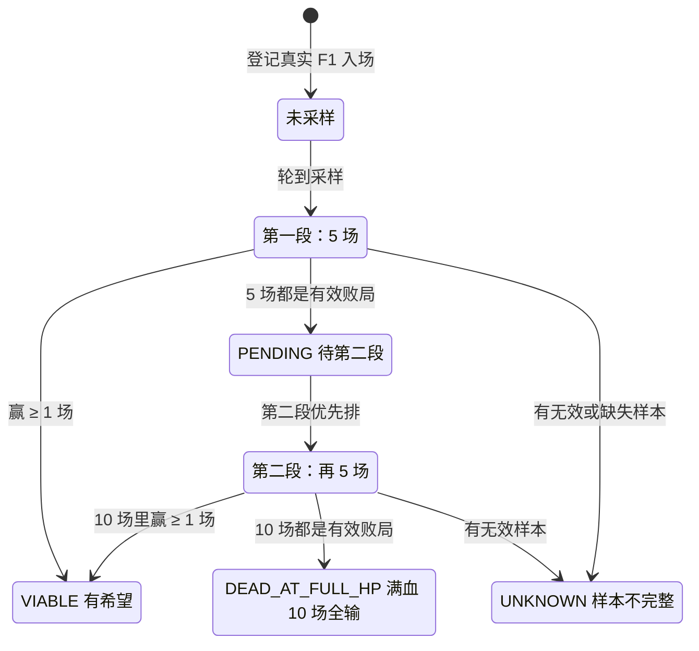

- **节奏**：每完成 20 个非合成、非缓存原生评估设置一个布尔信用，上限一个，不累计多组额度；一次只有一组采样在途，不占 allocation_serial 计数。
- **谁先采**：待第二段的组 → 待处理关口重试的入口 → 聚焦精英的 F1 入场 → 最早登记的。
- **分组**：牌组 / 遗物相同的入场共用样本（启发式共享，不是状态相等）；每个真实入场仍保留自己最好的原生 F1 结果给联合表。
- **样本**：随机数由 `(solver_seed, 入场, 段)` 派生，单成员 E45 计划；已有选牌对照表的入场，底牌臂的 5 个样本直接算第一段，第二段避开这些随机数。
- **用途**：联合表的 F2 目标（第 9 节）、聚焦器的联合顺序（第 8 节）、关口重试的后放（第 10 节）。
- **含义**：满血 F2 和真实路线带进 F2 的生命不同；UNKNOWN 不是败局；10 场全输也不证明这副牌赢不了。

### 11.2 选牌对照表（`paired_card_probes.py`）

- **触发**：真实最终幕 F1 不同入场数到阈值 1、32、64、96 …（每 32 个一张）。牌组、遗物、候选牌都与以前某张表相同的入场跳过，阈值保持待触发。
- **一张表**：在这个入场的 F1 前地图边界，"不加牌"（`card_skip`）和"加一张候选牌"各一臂；候选牌是这条轨迹实际出现过的卡牌奖励（本幕优先，按出现次数），最多 5 张。每臂满血打 F2，5 个共享随机数样本，单成员 E45。
- **结果**：每张牌的增益 = 该臂均值 − 不加牌的均值；多张完整表取平均（merge mean），只有配齐的表才变成第三幕 `paired:card:X` 档位。
- **联合表**：加牌臂作为联合表的行（借用底入口的真实 F1 结果）。

---

## 12. 提案类工作：F1 赢法复用、路线与准备、内存前缀

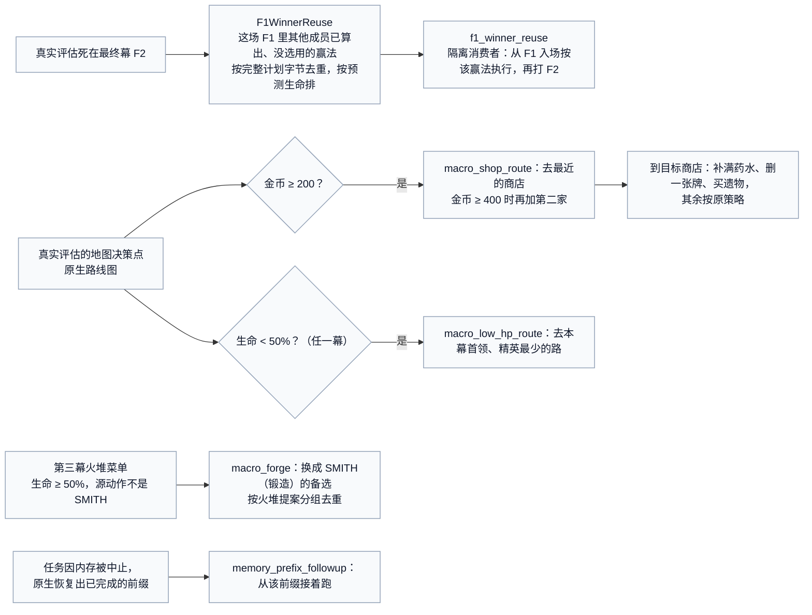

- 每条源评估最多 4 个准备提案（`preparation_limit 4`）。路线只用原生给出的真实地图节点和边；每一步执行时原生宿主重新核对合法性。
- 这些都只是"多试一条"，不是剪枝，不证明别的路线不行。F1 赢法是未验证的计划，只有原生执行加独立重放才能确认。

---

## 13. 胜利验证

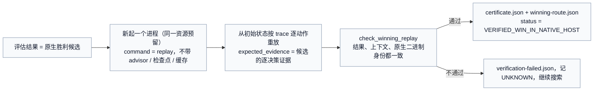

证书证明 mode1 布尔目标在已验证规则范围内达到上界 1；不证明分数或生命最优，也不是正常 Godot 游戏等价验证。

---

## 14. 参数速查（公开 30 分钟启动配置）

以下示例采用默认 30 分钟（搜索 1770 s、Job 主动预算 1800 s）。选择 45 分钟时对应搜索 2670 s、Job 主动预算 2700 s。运行预算、资源与窗口由公开启动器叠加，功能 profile 的默认值分别解析；完整设置由干跑输出并随作业保存。

```text
--workers 7 --dop 1 --reserve-mib 1024 --evaluations 1000000 --seconds 1770 --task-seconds 1200
--max-decisions 12000 --lookahead-actions 12000 --lookahead-floors 99 --alternatives 8 --survivors 2
--budget-ms 600000 --boss-budget-ms 600000 --nodes 60000 --profile Low
--dispatch ordered --dispatch-window 56 --solver-seed 271828 --low-io --event-driven-settle
--checkpoint-mib 1024 --cache-mib 128 --archive-entries 256
--scheduler focus --prior --gate-preset escalate-evaluate --repair-mode gate --normal-nodes 10000
--runtime-profile server-bounded-large-gen0 --worker-memory-mib 1792
--f1-winner-reuse --prefer-f1-hp --gold-shop-routes --low-hp-routes --low-hp-routes-any-act
--lean-third-act --shop-preparation --resource-telemetry --memory-telemetry --preserve-completed-prefix
--f2-readiness-probes --f2-dead-retry --f2-joint-focus --f2-joint-model
--root-policies pick,elo --focus-cluster-cap 2 --final-gate-plan open --root-async --requeue-lost 1
--focus-stall 32 --focus-stall-extended --focus-stall-f2
--paired-card-every 32 --paired-card-dedup --paired-card-merge mean      (paired-card-joint 随联合表自动开)
```

| 参数 | 值 | 含义 |
|---|---|---|
| `workers` / `dop` | 7 / 1 | 常驻 worker 数，每个 worker 的战斗搜索单线程 |
| `reserve-mib` / `worker-memory-mib` | 1024 / 1792 | 协调器预留，每个 worker 的内存上限；公开入口要求满足请求 worker 数，资源不足拒绝 |
| `seconds` / `task-seconds` | 1770 / 1200 | 搜索预算（不计暂停），单个原生任务上限 |
| `dispatch-window` | 56 | 有序派发时在途普通评估上限 |
| `focus_elites` / `focus_pool` / `focus_share` / `site_cap` | 8 / 48 / 3 / 12 | 精英数、精英池、每个探索评估对应的聚焦评估数、宽菜单延后 |
| `focus-cluster-cap` | 2（Jaccard 75%） | 同一牌组族最多几个精英 |
| `focus-stall` | 32 | 卡住阈值（不同入场数） |
| `gate_retry_percent` | 50 | 关口重试的"接近过关"门槛 |
| `root_round` | 7 | 根批次第一轮的评估数 |
| `requeue-lost` | 1 | 因内存丢失的提议最多重派次数 |
| `f2_readiness_every` | 20 | 每多少个非合成原生完成攒一次采样额度 |
| `paired-card-every` | 32 | 选牌对照表的入场间隔 |
| `gold_shop_threshold` / `low_hp_percent` / `preparation_limit` | 200 / 50 / 4 | 商店路线金币门槛、低血路线门槛、每条源评估的准备提案上限 |
| `survivors` | 2 | 每批吸收后续跑的边界评估数 |
| `snapshot_stride` | 7 | 每多少条记录写一次 `result.json` |

公开运行设置为 `A10-seed-v2`：自动选择 8 个同类型逻辑 CPU，14 GiB Job 工作负载 + 2 GiB 预留；默认主动时间上限 1800 s，可选 45 分钟为 2700 s。接入暂停账本时排除暂停时间。

---

## 15. 关键文件索引

| 文件 | 内容 |
|---|---|
| `spire_exact/planning/__main__.py` | 参数解析、配置组装、advisor（关口计划、`FinalBoss`）、进程池、调用 `solve` |
| `spire_exact/planning/final_defaults.py` | i082 默认开关表（`FINAL_FEATURES`、`I081_FEATURES`、`I082_PLANNER`） |
| `spire_exact/planning/search.py` | `SearchConfig`、`Evaluator`、`solve` 主循环、`absorb`、`save` |
| `spire_exact/planning/focus.py` | `FocusScheduler`：精英池、族上限、联合聚焦、卡住回退 |
| `spire_exact/planning/indexed_strategy.py`、`strategy.py` | 探索器（前缀树、分桶堆、类别权重）、失败假设 |
| `spire_exact/planning/lineage.py` | 谱系与按谱系的卡住回退 |
| `spire_exact/planning/gatemodel.py` | 关口模型、`prior`、`z` |
| `spire_exact/planning/f2_joint_model.py` | 两个首领联合表 |
| `spire_exact/planning/f2_readiness.py` | F2 满血就绪度两段采样 |
| `spire_exact/planning/paired_card_probes.py` | 第三幕选牌对照表 |
| `spire_exact/planning/f1_winners.py` | F2 失败后复用已算出的 F1 赢法 |
| `spire_exact/planning/preparation.py` | 商店路线、低血路线、锻造备选、商店准备 |
| `spire_exact/planning/repairs.py`、`gates.py` | 关口重试队列、关口计划预设 |
| `spire_exact/planning/policies.py`、`policy_data.py` | 根策略档位表（后者是生成文件） |
| `spire_exact/planning/archive.py` | 检查点 trie、结果缓存、前沿、`utility`、`combat_loss_progress` |
| `spire_exact/planning/pool.py`、`resources.py` | 原生进程池、运行时配置、内存准入 |
| `spire_exact/planning/memory_prefix.py`、`research_progress.py` | 内存中断后的前缀恢复、研究进度契约 |
| `native/SpireNativeHost/Program.cs` | 原生命令入口 |
| `native/SpireNativeHost/CampaignReplay.cs` | 整局执行、合法菜单、rollout 策略、检查点与证据 |
| `native/SpireNativeHost/BeamAdvisor.cs` | 战斗搜索桥接、关口计划 |
| `native/SpireNativeHost/GateProbe.cs`、`CardMenuProbe.cs` | 合成探针 |
| `native/SpireNativeHost/MapRouteReplay.cs`、`NativeRouteGraph.cs`、`ShopPreparation.cs`、`PreparationMenus.cs` | 路线计划执行与准备 |
| `native/SpireNativeHost/StrategicStateEvaluator.cs` | 原生手写打分 |
| `tools/run_release_source.py`、`tools/prepare_dashboard.py`、`tools/limited_cli.py` | 公开启动、前端准备、资源边界；run_seed/run_queue 保留研究用法 |
| `dashboard/` | SpireBoard |

---

## 16. 不变量：改代码时不能破坏的规则

1. 只有新进程、不带 advisor / 检查点 / 缓存、从初始状态完整重放并观察到原生 `OnEnded(true)` 的路线算胜利。
2. 死亡、束搜索丢弃、预算或时间上限、探针失败都不证明种子无解或分支不可行；未展开的区域保持 UNKNOWN，上界 1。
3. 合成探针只在一次性进程里跑，标 `synthetic=true`；结果只更新排序信号，不加入真实轨迹、检查点档案、结果缓存、精英前沿或关口模型真实行。
4. 状态和入口身份用完整字节（完整动作前缀、规范化请求），不用哈希或特征向量判定相等。
5. 保存 `solver_seed`、完整配置、按序评估账本和资源事件。确定性取样与有序非就绪度吸收提供可复现基础；就绪度完成即收、超时与资源重派需纳入比较。
6. 请求 JSON 里不放浮点数，比例用整数百分比。
7. 档位、模型值、族上限、卡住回退都只改先后，不删除分支、不改变合法性。
8. 原冻结与历史证据不可修改。公开作业绑定本机准备后的源码/宿主身份，运行中保持输入不变；前端暂停只保留存活进程状态。
